# Time Management System

Целью работы системы является мониторинг рабочего времени сотрудников.

**Сводная диаграмма БД**

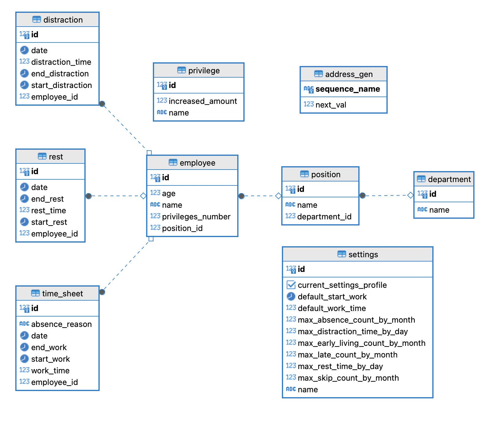

**Стек технологий**

* Spring boot 3
* ReactJS
* PostgreSQL
* Criteria API
* Spring data JPA
* Stream API
* Collections
* Hibernate
* Jakarta Bean Validation
* Docker compose
* Тесты написаны с использованием базы данных H2 в памяти

**Запуск приложения**

Предварительно должен быть запущен Docker
* Скачать проект
* Запустить файл docker-compose.yml с помощью кнопки из IntellijIdea или с помощью терминала, перейдя в папку с проектом и набрав команду "docker-compose up --build". БД развернется автоматически
* Перейти по ссылке http://localhost:3000/

**Приложение делится на 9 основных вкладок. На каждой вкладке присутствует фильтр и сортировка**

1. Сотрудники
2. Должности
3. Отделы
4. Отклонения
5. Табели рабочего времени
6. Табели отвлечений
7. Табели перерывов
8. Настройки лимитов распорядка дня сотрудников
9. Настройки привилегий

## 1, 2, 3. "Сотрудники", "Должности", "Отделы"

Отображается сводная информация за период не более одного года, иначе выбрасывается alert с предупреждением об ошибке. 

Все алерты по валидации выдают информацию с сообщением, статусом, статус кодом и timestamp
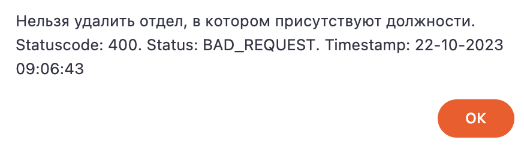

**Присутствует группировка по отделам, должностям или сотрудникам.** 

В таблицах присутствуют общие для всех группировок колонки:
1. **Наименование.**
2. **Суммарное отработанное время.** Рассчитывается как разница между временем начала и окончанием работы. Также отображается информация в % соотношении от нормы рабочего времени.
3. **Суммарное продуктивное время.** Рассчитывается как суммарное время отвлечений + суммарное время перерывов - суммарное отработанное время. Также отображается информация в % соотношении от суммарного отработанного времени.
4. **Суммарное время отвлечений.** Отвлечением считается когда сотрудник переключается с целевой программы на постороннюю (например из "1с" на хром). Рассчитывается как сумма всех отвлечений за день (каждое отвлечение рассчитывается как разница между временем начала и окончания отвлечения). Также отображается информация в % соотношении от суммарного отработанного времени.
5. **Суммарное время перерывов.** Рассчитывается как сумма всех перерывов за день (каждый перерыв рассчитывается как разница между временем начала и окончания перерыва). Также отображается информация в % соотношении от суммарного отработанного времени.
6. **Переработки.** Отображает информацию о том перерабатывают, не дорабатывают или работают по норме сотрудники. Рассчитывается как разница между отработанным временем и нормой рабочего времени за день. Также отображается информация в % соотношении от нормы рабочего времени.

При группировке по **сотрудникам** появляется возможность редактировать, создавать и удалять сотрудники. При редактировании и создании присутствует валидация имени по количеству символов, чтобы имя не начиналось и не заканчивалось с пробелов, содержало только буквы российского и английского алфавита.  При удалении сотрудника удаляется также и вся информация по отработанному времени, связанная с этим сотрудником. Также для сотрудников выводится информация о возрасте, должности, отделе и присвоенных привилегиях.

Привилегии хранятся в виде числа. Описания привилегий хранятся в enum и каждой из них строго задан порядковый номер бита. В процессе маппинга в дто происходит преобразование числа в двоичную систему счисления, затем проверяется какой из битов равен 1, вследствие чего формируется соответствующий список и наоборот для маппинга в сущность.

**Величина всех норм и привилегий задается в настройках. При расчетах учитываются рабочие/нерабочие дни недели по календарю**

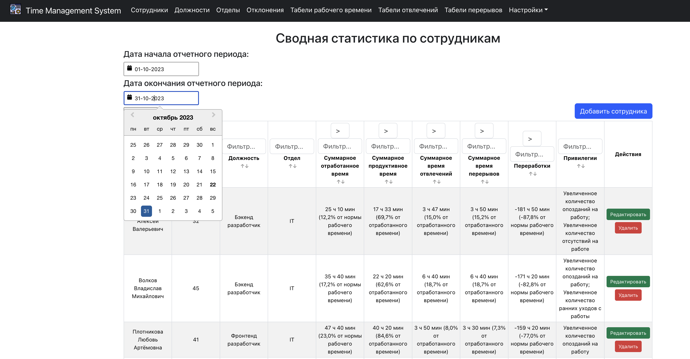
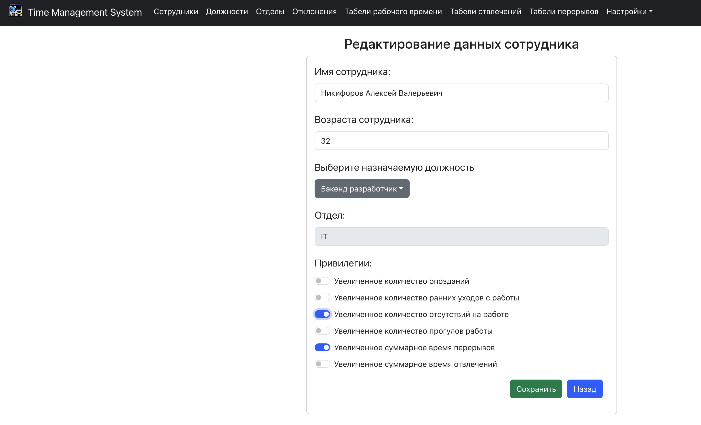

При группировке по **должностям** появляется возможность редактировать, создавать и удалять должности. При редактировании и создании присутствует валидация наименования по количеству символов, чтобы имя не начиналось и не заканчивалось с пробелов, содержало только буквы российского и английского алфавита.  Если при удалении должности к ней остаются привязанные сотрудники, выбрасывается alert с описанием ошибки. Также для должностей выводится информация об отделе.

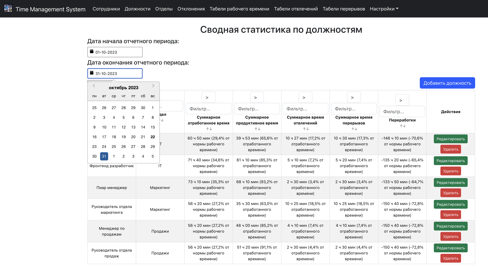
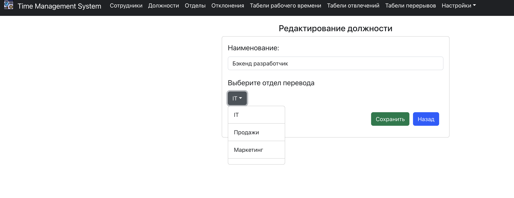

При группировке по **отделам** появляется возможность редактировать, создавать и удалять отделы. При редактировании и создании присутствует валидация наименования по количеству символов, чтобы имя не начиналось и не заканчивалось с пробелов, содержало только буквы российского и английского алфавита. Если при удалении отдела к нему остаются привязанные должности, выбрасывается alert с описанием ошибки.

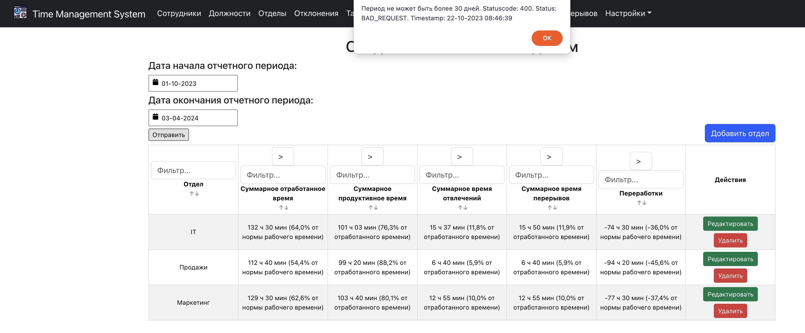
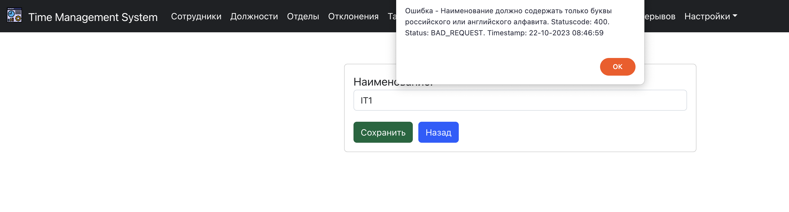

## 4. "Отклонения"
Отображается сводная информация об отклонениях от норм рабочего дня сотрудников за месяц

**Величина всех норм и привилегий задается в настройках. При расчетах учитываются рабочие дни**

В таблице присутствуют колонки:
1. **Полное имя сотрудника**
2. **Суммарное количество отклонений.** Рассчитывается как сумма всех отклонений.
3. **Суммарное количество опозданий.** Опозданием считается когда время начала работы сотрудника больше чем норма начала рабочего дня. Также отображается информация в процентном соотношении от максимально заданного количества опозданий в месяц. При расчете процента учитывается наличие привилегии "Увеличенное количество опозданий на работу".
4. **Суммарное количество ранних уходов.** Ранним уходом считается когда отработанное время сотрудника менее чем норма рабочего времени (если сотрудник опоздал на работу, то должен уйти позже). Также отображается информация в процентном соотношении от максимально заданного количества ранних уходов в месяц. При расчете процента учитывается наличие привилегии "Увеличенное количество ранних уходов с работы".
5. **Суммарное количество отсутствий.** Отсутствием считается когда время начала работы сотрудника равно null и причина отсутствия (хранится в сущности TimeSheet которая связана с работником) не равна null. Также отображается информация в процентном соотношении от максимально заданного количества отсутствий в месяц. При расчете процента учитывается наличие привилегии "Увеличенное количество отсутствий на работе".
6. **Суммарное количество прогулов.** Прогулом считается когда время начала работы сотрудника равно null и причина отсутствия (хранится в сущности TimeSheet которая связана с работником) равна null. Также отображается информация в процентном соотношении от максимально заданного количества прогулов в месяц. При расчете процента учитывается наличие привилегии "Увеличенное количество прогулов работы".
7. **Суммарное количество превышений времени отвлечений.** Превышением считается когда суммарное время отвлечений за день больше максимально заданного. Также отображается информация в процентном соотношении от максимально заданного количества превышений отвлечений в месяц. При расчете процента учитывается наличие привилегии "Увеличенное суммарное время отвлечений за день" (засчитывается меньшее количество отвлечений).
8. **Суммарное количество превышений времени перерывов.** Превышением считается когда суммарное время перерывов за день больше максимально заданного. Также отображается информация в процентном соотношении от максимально заданного количества превышений перерывов в месяц. При расчете процента учитывается наличие привилегии "Увеличенное суммарное время перерывов за день" (засчитывается меньшее количество перерывов).
9. **Список привилегий сотрудника**

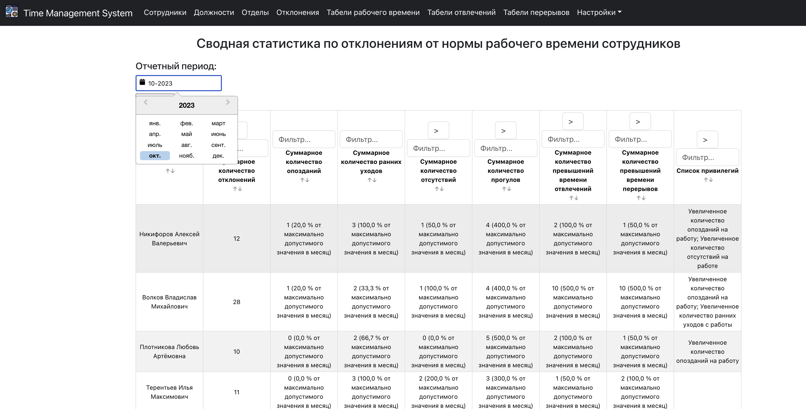

## 5. "Табель рабочего времени"
Отображается сводная информация о рабочих днях сотрудников за период не более 30 дней, иначе выбрасывается alert с предупреждением об ошибке.

Присутствует возможность редактировать, создавать и удалять табели рабочего времени. При редактировании и создании присутствует валидация даты по паттерну "dd-mm-yyyy", валидация времени по паттерну "hh:mm".

В таблице присутствуют колонки:
1. **Дата**
2. **Время начала рабочего дня** 
3. **Время окончания рабочего дня**
4. **Суммарное отработанное время**
5. **Причина отсутствия**

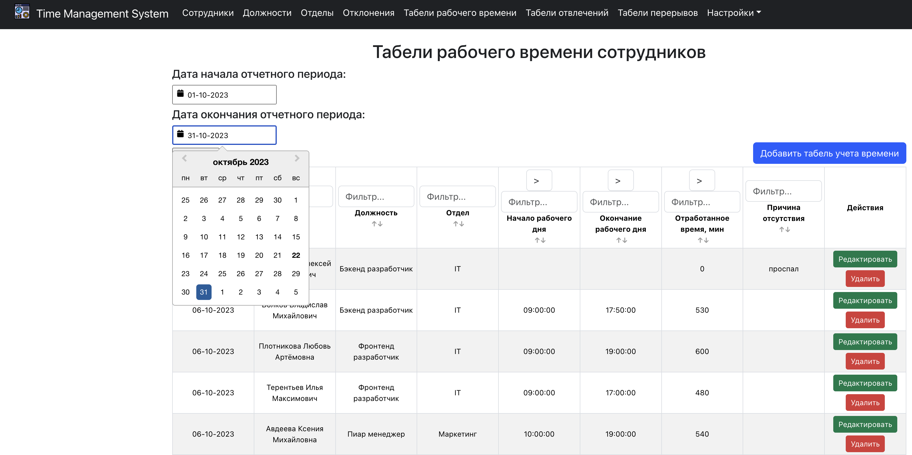
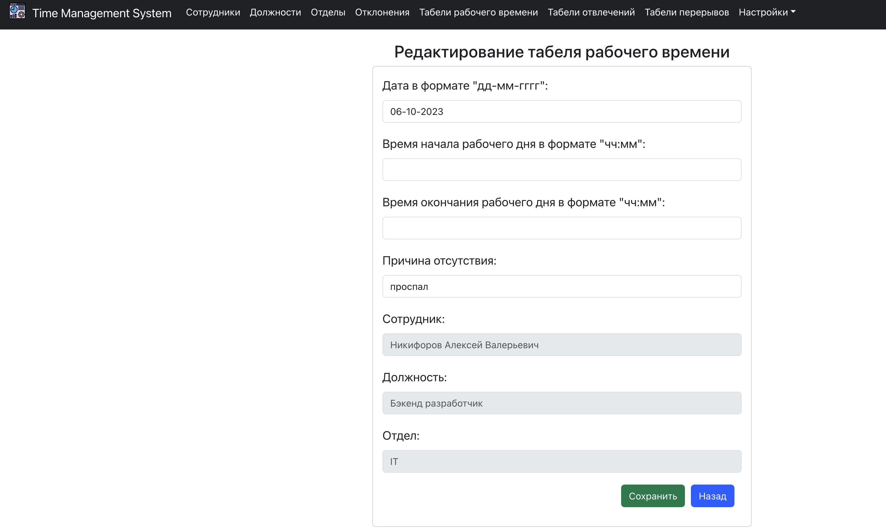

## 6. "Табель перерывов"
Отображается сводная информация о перерывах сотрудников за период не более 30 дней, иначе выбрасывается alert с предупреждением об ошибке.

Присутствует возможность редактировать, создавать и удалять табели перерывов. При редактировании и создании присутствует валидация даты по паттерну "dd-mm-yyyy", валидация времени по паттерну "hh:mm".

В таблице присутствуют колонки:
1. **Дата**
2. **Время начала перерыва**
3. **Время окончания перерыва**
4. **Суммарное время перерывов**

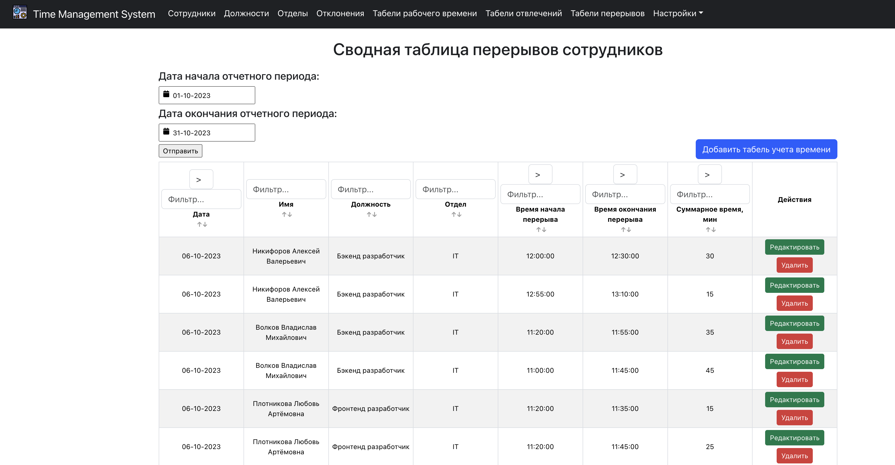
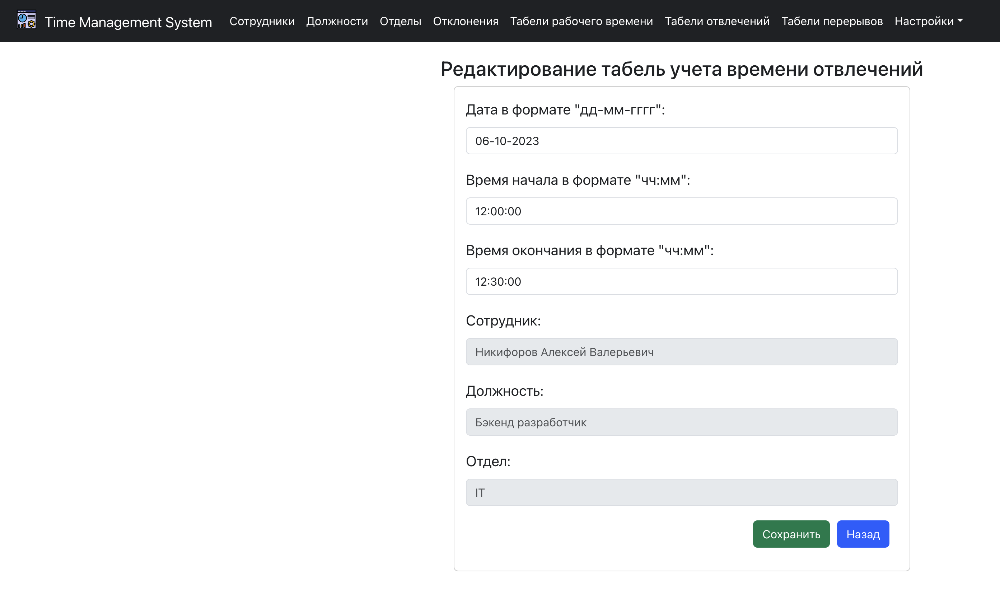

## 7. "Табель отвлечений"
Отвлечением считается когда сотрудник переключается с целевой программы на постороннюю (например из "1с" на хром). Отображается сводная информация об отвлечениях сотрудников за период не более 30 дней, иначе выбрасывается alert с предупреждением об ошибке.
Присутствует возможность редактировать, создавать и удалять табели отвлечений. При редактировании и создании присутствует валидация даты по паттерну "dd-mm-yyyy", валидация времени по паттерну "hh:mm".

В таблице присутствуют колонки:
1. **Дата**
2. **Время начала отвлечения**
3. **Время окончания отвлечения**
4. **Суммарное время отвлечений**

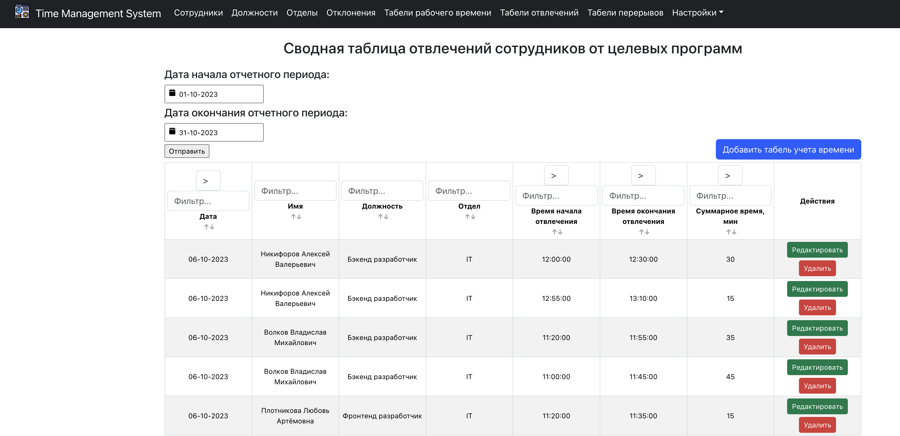
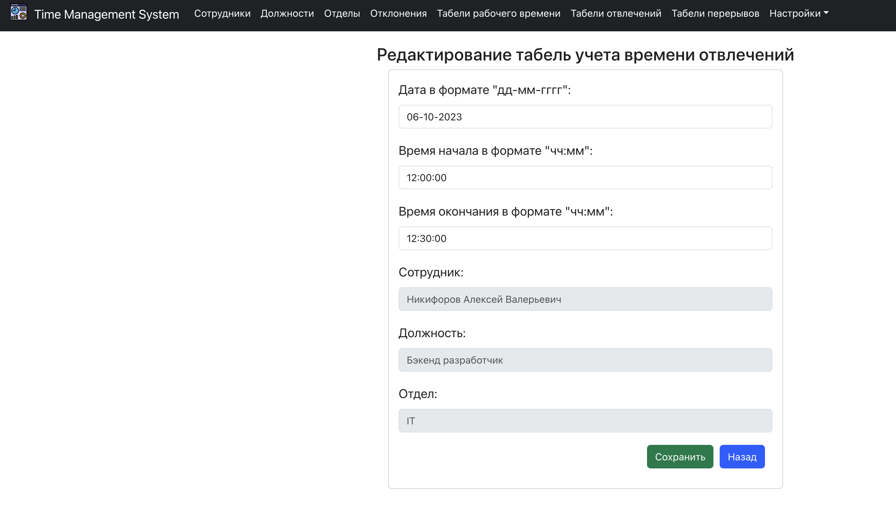

## 8. "Настройки лимитов распорядка дня сотрудников"
На данной вкладке задается величина всех норм. 

Присутствует возможность редактировать, создавать и удалять профиль настроек. При редактировании и создании присутствует валидация наименования по количеству символов, чтобы имя не начиналось и не заканчивалось с пробелов, содержало только цифры и буквы российского или английского алфавита.

При редактировании и удалении проводится валидация на существующий активный профиль. Если попытаться удалить активный профиль вылетает алерт с ошибкой. Также если попытаться удалить все профили вылетает алерт, что должен быть активен хотя бы один профиль.

Колонки:
1. **Наименование профиля**
2. **Активен.** Профиль настроек активированный в данный момент. Может быть активен только 1 профиль настроек.
3. **Норма рабочего времени за день**
4. **Норма начала рабочего дня**
5. **Максимальное количество опозданий в месяц**
6. **Максимальное количество уходов с работы до истечения нормы рабочего времени**
7. **Максимальное количество отсутствий за месяц**
8. **Максимальное количество прогулов за месяц**
9. **Максимальное суммарное время отвлечений в день**
10. **Максимальное суммарное время перерывов в день**
11. **Максимальное число превышений времени отвлечений в месяц**
12. **Максимальное число превышений времени перерывов в месяц**

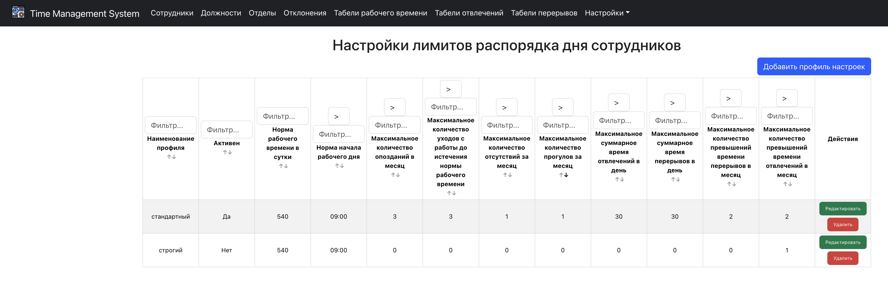
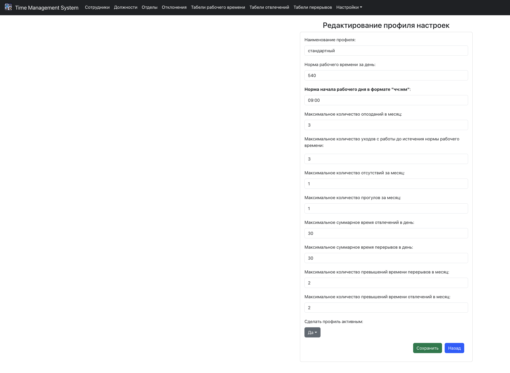

## 9. "Настройки привилегий"
На данной вкладке задается величина всех привилегий

Присутствует возможность только редактировать значения привилегий.

Колонки:
1. **Наименование**
2. **Значение**

В БД хранятся значения привилегий:
1. **Норма начала рабочего дня**
2. **Максимальное количество опозданий в месяц**
3. **Максимальное количество уходов с работы до истечения нормы рабочего времени**
4. **Максимальное количество отсутствий за месяц**
5. **Максимальное количество прогулов за месяц**
6. **Максимальное суммарное время отвлечений в день**
7. **Максимальное суммарное время перерывов в день**

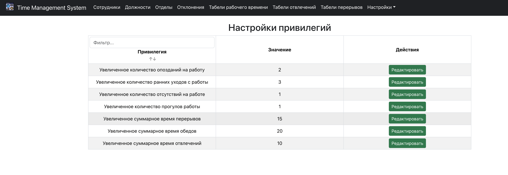
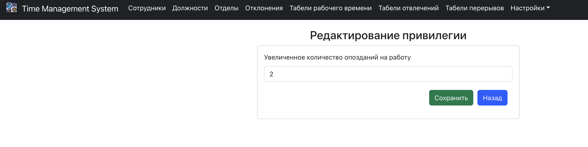